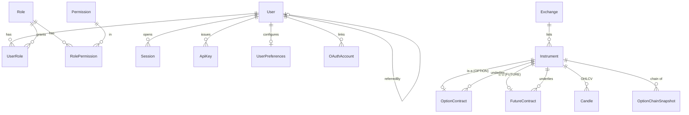
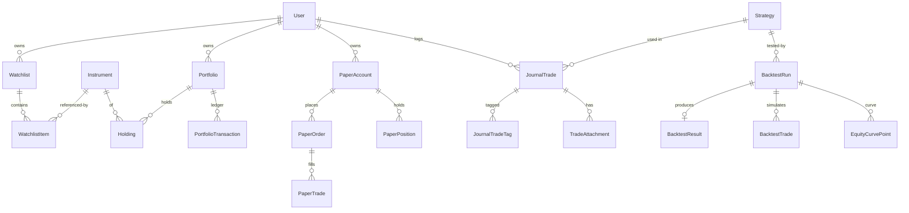
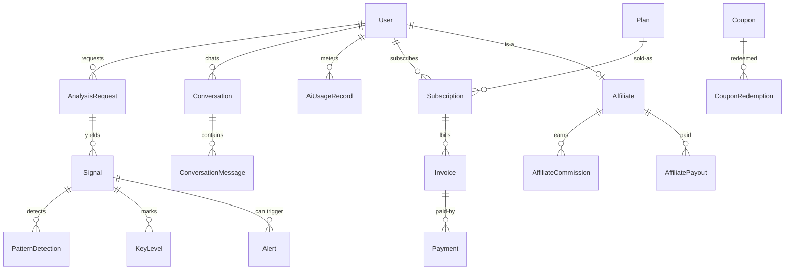

# Database Design — DEVQUANTIC AI Trading Analyst

**Engine:** PostgreSQL · **ORM:** Prisma (multi-file schema under
[`apps/api/prisma/schema/`](../../apps/api/prisma/schema)) · **78 models · 52 enums.**

The schema is validated with `prisma validate` and auto-formatted with `prisma format`.

---

## 1. Conventions

| Concern | Convention |
|---|---|
| **Primary keys** | `String @id @default(cuid())` — collision-resistant, URL-safe, non-enumerable |
| **Table names** | `@@map("snake_case_plural")`; models are `PascalCase` singular |
| **Timestamps** | `createdAt @default(now())`, `updatedAt @updatedAt` on mutable rows |
| **Soft delete** | `deletedAt DateTime?` on `User` (extendable); most rows hard-delete via cascade |
| **Money** | `Decimal @db.Decimal(12,2)` (fiat amounts) / `(20,4)` (balances/PnL) — **never floats** |
| **Prices / qty** | `Decimal @db.Decimal(20,8)` price, `(30,8)` quantity — crypto-grade precision |
| **Percent / ratios** | `Decimal @db.Decimal(x,3-4)` |
| **Currency** | ISO-4217 `String @db.VarChar(3)`, default `INR` |
| **Flexible payloads** | `Json` for rule graphs, snapshots, provider metadata, indicator dumps |
| **Enums** | PostgreSQL native enums, centralized in [`enums.prisma`](../../apps/api/prisma/schema/enums.prisma) |
| **Referential actions** | `Cascade` for owned children, `SetNull` for optional refs, `Restrict` for plans |
| **Secrets** | Token/2FA/broker-credential columns are **encrypted at the application layer** before insert — the DB stores ciphertext only |

---

## 2. Domain map (bounded contexts → files)

| Context | File | Core models |
|---|---|---|
| Identity & RBAC | `identity.prisma` | User, Role, Permission, RolePermission, UserRole, Session, OAuthAccount, VerificationToken, TwoFactorBackupCode, ApiKey, UserPreferences |
| Security & audit | `security.prisma` | AuditLog, SecurityEvent, LoginAttempt, ApiUsageLog |
| Market reference | `market.prisma` | Exchange, Instrument, OptionContract, FutureContract, Candle, OptionChainSnapshot |
| Watchlist | `watchlist.prisma` | Watchlist, WatchlistItem |
| Portfolio | `portfolio.prisma` | Portfolio, Holding, PortfolioTransaction |
| Trade journal | `journal.prisma` | JournalTrade, JournalTag, JournalTradeTag, TradeAttachment |
| Paper trading | `paper-trading.prisma` | PaperAccount, PaperOrder, PaperPosition, PaperTrade, PaperTransaction |
| Strategies | `strategy.prisma` | Strategy, StrategyVersion |
| Backtesting | `backtesting.prisma` | BacktestRun, BacktestResult, BacktestTrade, EquityCurvePoint |
| AI / signals | `ai.prisma` | AnalysisRequest, Signal, PatternDetection, KeyLevel, VisionAnalysis, Conversation, ConversationMessage, AiUsageRecord |
| Scanners | `scanner.prisma` | ScannerPreset, ScanRun, ScanResult |
| News | `news.prisma` | NewsSource, NewsArticle, NewsArticleInstrument |
| Risk | `risk.prisma` | RiskProfile |
| Alerts & notifications | `alerts.prisma` | Alert, AlertTrigger, Notification, NotificationChannel, PushSubscription |
| Billing | `billing.prisma` | Plan, Subscription, Invoice, Payment, Coupon, CouponRedemption, Referral, Affiliate, AffiliateCommission, AffiliatePayout, FeatureUsage, WebhookEvent |
| Broker | `broker.prisma` | BrokerConnection |
| System / ops | `system.prisma` | SystemSetting, FeatureFlag, MarketDataProviderConfig, JobRun |

---

## 3. Core ERD — Identity, RBAC & market reference

## 4. Trading ERD — the instrument as the universal reference

## 5. AI & billing ERD

---

## 6. Key design decisions

1. **`Instrument` is the single universal reference.** Watchlists, holdings, journal, paper
   trades, backtests, signals, scans, alerts and news all foreign-key to it. Options and
   futures are modeled as **specializations** (`OptionContract` / `FutureContract` with a unique
   `instrumentId`) *and* carry an `underlyingId` back to their underlying instrument — so a
   derivative is a first-class tradable while remaining linked to its cash instrument.

2. **Every signal is explainable and honest.** `Signal.reasons` (weighted factors),
   `Signal.indicators` (the snapshot used) and `Signal.rejection` (why a trade was declined)
   are all persisted. `NO_TRADE` and `WATCH` are first-class `SignalType` values — the schema
   is built to *reject* bad setups, never to imply guaranteed profit. No column asserts an outcome.

3. **No fabricated market data.** `Candle` and `OptionChainSnapshot` carry a `source` /
   provenance and unique keys `(instrument, timeframe, openTime)`; they are only ever populated
   from real providers via the market-data abstraction layer (Step 4).

4. **Financial correctness.** All monetary and price values are `Decimal` with explicit
   precision/scale — never floating point. Ledgers (`PortfolioTransaction`, `PaperTransaction`)
   are append-only with signed amounts and running balances.

5. **Billing built for India-first SaaS.** `Invoice` carries GST (`taxAmount`, `taxRatePct`,
   `taxDetails` for CGST/SGST/IGST + GSTIN), Razorpay ids on `Subscription`/`Invoice`/`Payment`,
   and `WebhookEvent` enforces **idempotent** webhook processing via `@@unique([provider, eventId])`.

6. **Metering & entitlements.** `FeatureUsage` (`@@unique([userId, feature, periodStart])`)
   snapshots the plan limit per period so quota enforcement is deterministic even across plan
   changes; `AiUsageRecord` tracks token/cost per LLM call.

7. **Security & auditability.** Append-only `AuditLog`, `SecurityEvent`, and `LoginAttempt`
   feed rate-limiting and anomaly detection. Refresh tokens, 2FA secrets, backup codes and
   API keys are stored **hashed/encrypted**, never in plaintext.

8. **Indexing strategy.** Composite indexes target real access paths — e.g.
   `Signal(userId, generatedAt)`, `Candle(instrumentId, timeframe, openTime)`,
   `Notification(userId, isRead)`, `AuditLog(entityType, entityId)`.

---

## 7. Operational notes

- **Migrations** (`prisma migrate dev` / `deploy`) land with the backend module (Step 4),
  where the Prisma client is generated and wired through the DI container. The generator
  targets Alpine/Debian OpenSSL binaries for containerized deployment.
- **Seeds** for system roles/permissions, subscription plans, exchanges and feature flags are
  authored alongside the auth/billing modules (they depend on hashing + config, introduced in
  Step 4) and live in [`apps/api/prisma/seeds/`](../../apps/api/prisma/seeds).
- **High-frequency ticks are intentionally NOT stored** in PostgreSQL — only reference data,
  historical candles for backtests, and periodic snapshots. A time-series store can be added
  behind the market-data layer without schema churn.
